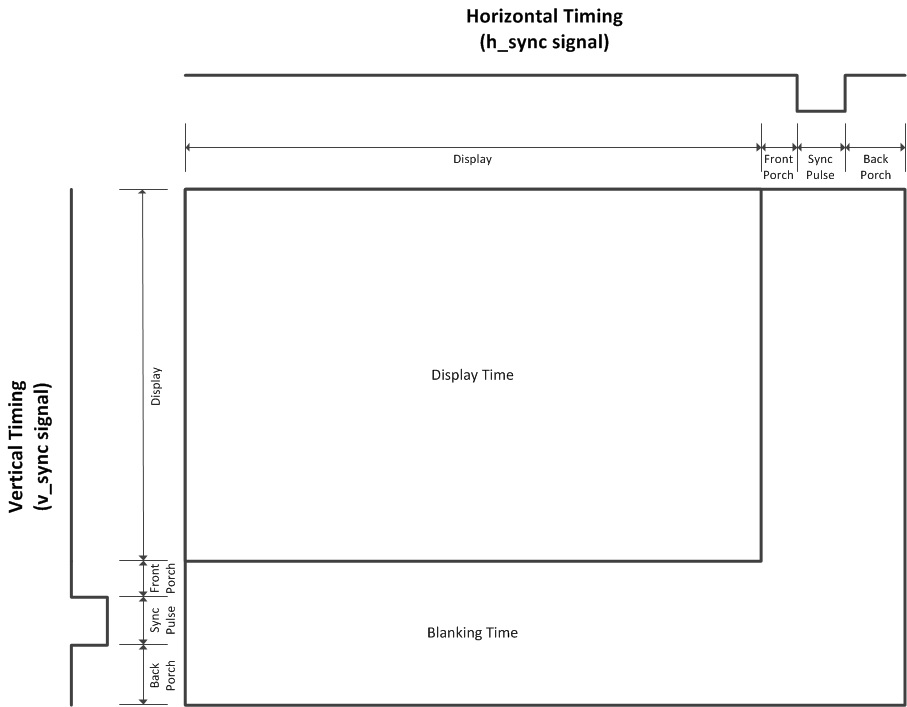
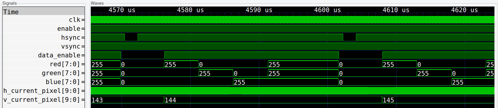
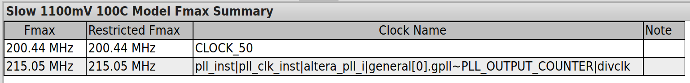

# Reporte Trabajo Final - Circuitos Lógicos Programables

_Puerto Montt, 14 de octubre de 2022, Nicolás Hasbún A._

Trabajos práctico final realizado en el contexto de la Carrera de Especialización de Sistemas Embebidos de la Universidad de Buenos Aires para el curso de circuitos lógicos programables.

[TOC]

# Resumen

Se implementa un módulo generador de señal de video VGA con resolución 640x480 a 60fps. El trabajo se divide en dos submódulos principales: 

- **vga_sync**: responsable de generar las señales de sincronización **vsync** y **hsync**. Además comunica al resto del sistema respecto al pixel que se recorre en la actualidad para despliegue de imagen.
- **pattern_gen**: responsable de generar un simple patrón de imagen en pantalla. Este módulo tiene como principal salida el canal de valores **RGB** con opciones para habilitar/deshabilitar los canales de manera independiente.

## Señales VGA

Las señales de sincronización necesarias para el despliegue de la imagen VGA fueron extraídas de las siguientes fuentes:

- [EEVblog: No bitbanging necessary, or How to Drive a VGA Monitor on a PSoC 5LP w/Verilog](https://www.eevblog.com/forum/projects/no-bitbanging-necessary-or-how-to-drive-a-vga-monitor-on-a-psoc-5lp-programmabl/msg825363/?PHPSESSID=qvr31vlffdvnvbb8qbjistkpp4#msg825363)

- [TinyVGA: VGA Signal 640 x 480 @ 60 Hz Industry standard timing](http://tinyvga.com/vga-timing/640x480@60Hz)

En particular de la página de **EEVBlog** fue útil ver el diagrama de señales **vsync y hsync** con las consiguientes denominaciones de *back porch, front porch, etc*. El diagrama mencionado se muestra a continuación:

En particular de la página **TinyVGA** fue útil extraer la tabla que explica el reloj necesario y la cantidad de espacio en pixeles ocupados por los sectores de *display, front porch, sync pulse y back porch* tanto para las señales horizontales como verticales. Las tablas utilizadas se observan a continuación:

## Kit de Desarrollo

Se utilizó el kit de desarrollo FPGA **DE10-Nano** del fabricante Terasic. Una imagen de la placa se observa a continuación:

Esta placa no tiene una salida **VGA** pero cuenta con una salida **HDMI** de fácil uso que sirve para nuestro propósito. El chip utilizado para la salida **HDMI** es el **ADV7513** y está conectado en la placa de desarrollo a la FPGA según el siguiente esquema:

Acá se utilizan las siguientes señales ya existentes en **vga_sync** y **pattern_gen**:

- **HDMI_TX_D:** corresponde al canal RGB.
- **HDMI_TX_CLK:** corresponde al reloj de cambio de pixel de  25.175 MHz.
- **HDMI_TX_HS y HDMITX_VS:** señales hsync y vsync de forma correspondiente.
- **HDMI_TX_DE:** corresponde a la señal que indica si un pixel se encuentra en el área de despliegue, esto se genera como extra en el módulo **vga_sync** pues es de implementación fácil en ese módulo.

El chip además necesita una configuración i2c al inicio de un ciclo de energía. Esto se despliega de forma fácil gracias a un módulo que entrega el fabricante que se incluye en el código entregado. Este módulo de nombre **I2C_HDMI_Config** maneja las siguientes señales: **I2C_SDA, I2C_SCL y HDMI_TX_INT**.

El resto de las señales pueden ser ignoradas.

## IP Cores

La implementación requiere un reloj de 25.175 MHz que se obtiene a partir de un IP Core **PLL Intel FPGA IP**. La FPGA cuenta con varios relojes de 50 MHz que provienen de la placa de desarrollo y que se hacen pasar por este PLL para obtener el reloj requerido para el video VGA.

# Diagrama de Bloques

Se tiene el siguiente esquemático RTL para la implementación de video VGA. Acá se incluye: los módulos principales **vga_sync** y **pattern_gen** junto con los módulos auxiliares **I2C_HDMI_Config** y **pll_clk**. Además se pueden ver todas las entradas y salidas del sistema.

# Simulaciones

Se realiza una simulación única contenida en el testbench **vga_module_tb** para ambos módulos **vga_sync** y **pattern_gen**. Las siguientes tomas con **gtwave** resultan de interés:

## Señales al inico

Se observa el funcionamiento de la señal **enable** y del inicio correcto de las señales de **hsync** y **vsync**. Además se observa el inicio de las coordenadas de pixel reportados por el módulo.

## Patrón RGB

Se observa el patrón RGB esperado. Además puede corroborarse el funcionamiento de la señal **data_enable** junto con el *front porch* y *back porch* de la señal **hsync**.

## Límites de hsync y vsync

Se observa el correcto fin de la señal **data_enable** al fin del pixel horizontal 639 (recordar que índice empieza con cero). Se puede observar la sección de *front porch* y el *sync pulse* para la señal **hsync**.

Se observa el correcto fin de la señal **data_enable** al fin del pixel vertical 479 (recordar que índice empieza con cero). Se puede observar la sección de *front porch*, el *sync pulse* y *back porch* para la señal **vsync**.

# Recursos de FPGA

Reportes respecto al uso de recursos y restricciones temporales.

